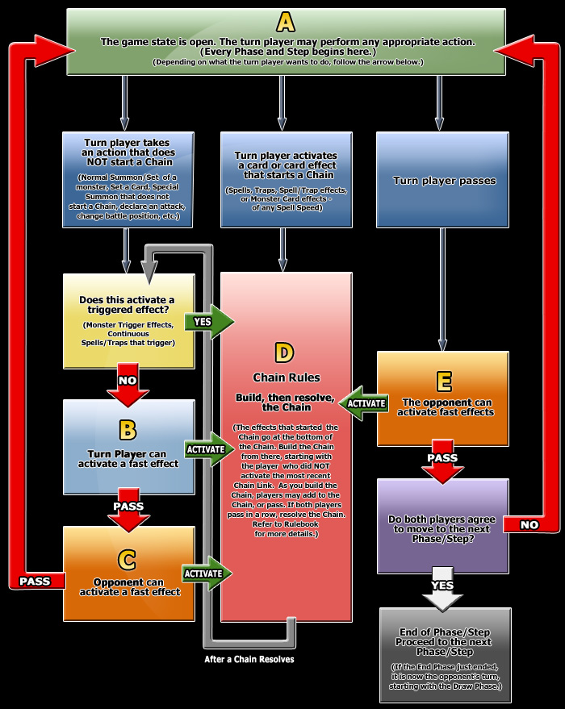

  
```{r setup, include=FALSE}
knitr::opts_chunk$set(echo = TRUE)
```
# This page is a quick reference to different tournament documents as well as documents which are important to know for beginner and experienced judges alike


  
## **POLICY DOCUMENTS**
  
  Here are some links to the most recent Konami Policy Documents. 

  [**Tournament Policy**](http://www.yugioh-card.com/it/gameplay/rulings/KDE_TCG_TournamentPolicy_v1.3_2013February01.pdf)
  
  [**Penalty Guidelines**](http://www.yugioh-card.com/uk/gameplay/rulings/Penalty_Guidelines_1_4.pdf)
  
## **Rules Resources**

Here are some links to some rules related articles on PSCT and the most recent verion of the Yu-Gi-Oh! Rulebook

[Here](http://www.yugioh-card.com/en/rulebook/) is a link where you can download the most recent version of the Official Yu-Gi-Oh! rulebook.

## Fast Effect Timing Chart
This chart is one of the most important things to understand in Yu-Gi-Oh!. It is the fast effect timing chart and is a graphic which allows us to understand the breakdown of how the gamestate functions. As a judge, it helps answer many player questions when players inadvertantly create improper gamestates for one reason or another. 

```{r, echo=FALSE}

```
